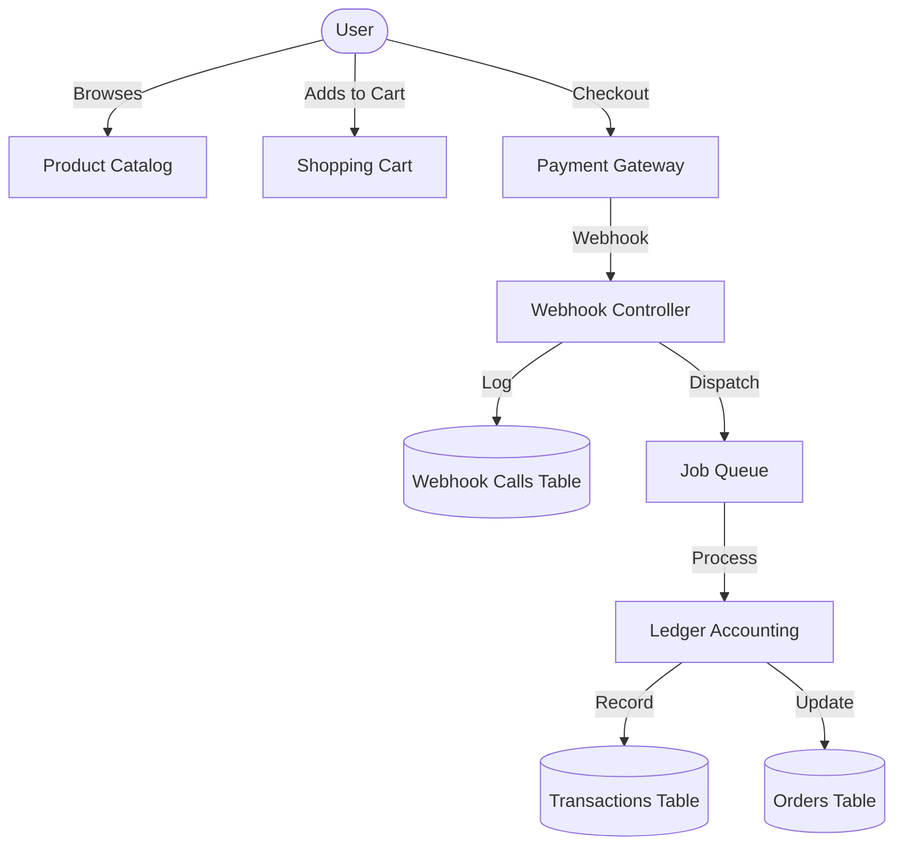
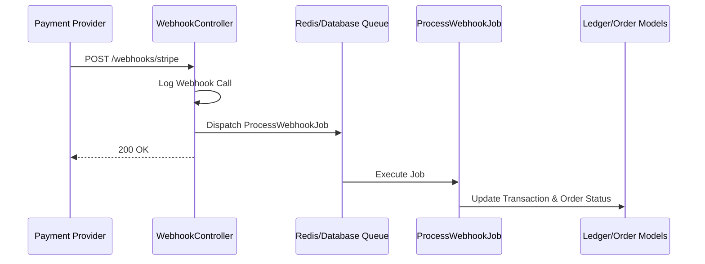

# UPWEARLANE

A Laravel shop application with Inertia.js and React.

**[Live Demo: upwearlane.com](https://upwearlane.com)**

## Getting Started

### Prerequisites

- PHP
- Composer
- Node.js & npm

### Installation

1. Clone the repository
2. Install dependencies:
   ```bash
   composer install
   npm install
   ```
3. Copy `.env.example` to `.env` and configure your database.
4. Generate application key:
   ```bash
   php artisan key:generate
   ```
5. Run migrations:
   ```bash
   php artisan migrate
   ```
6. Start the development server:
   ```bash
   npm run dev
   ```

## Tech Stack

- **Backend**: Laravel
- **Frontend**: Inertia.js, React, Tailwind CSS
- **Build Tool**: Vite

## System Architecture & Documentation

### System Overview
UpWearLane is a modern e-commerce platform built with Laravel and React. It features a robust backend for payment processing, ledger accounting, and SEO optimization.

### Services & Components
- **Inertia Services**: Handles the bridge between Laravel and React.
- **Payment Gateway (Stripe/Paystack)**: Manages financial transactions.
- **Queue System**: Process webhooks and email notifications asynchronously.
- **Ledger System**: Tracks all financial movements in the `transactions` table.
- **SEO Engine**: Dynamic sitemap and metadata management.

### Data Flow


### Queue Flow


### Webhook Flow (Reliability)
Our system ensures reliability by logging every incoming webhook before processing. If a job fails, it can be retried using Laravel's queue management without losing the original payload.

---

### Database Schema & Data Integrity
We prioritize data integrity through relational constraints and transaction safety.

#### Database Tables
- **Users**: Authentication and profile data.
- **Orders**: Core order details and totals.
- **Transactions**: Ledger records of all financial events.
- **Payments**: External payment reference tracking.
- **Webhook Calls**: Audit log of all incoming gateway signals.

#### Relationships & Constraints
- `transactions` belongs to `orders` (Foreign Key: `order_id`).
- `orders` belongs to `users` (Foreign Key: `user_id`).
- All financial operations are wrapped in `DB::transaction` to ensure atomicity.

#### Transaction Safety
- **Atomic Locks**: Used during payment confirmation to prevent double-processing.
- **Idempotency**: `X-Idempotency-Key` headers are processed to ensure duplicate requests return identical results without re-executing logic.
